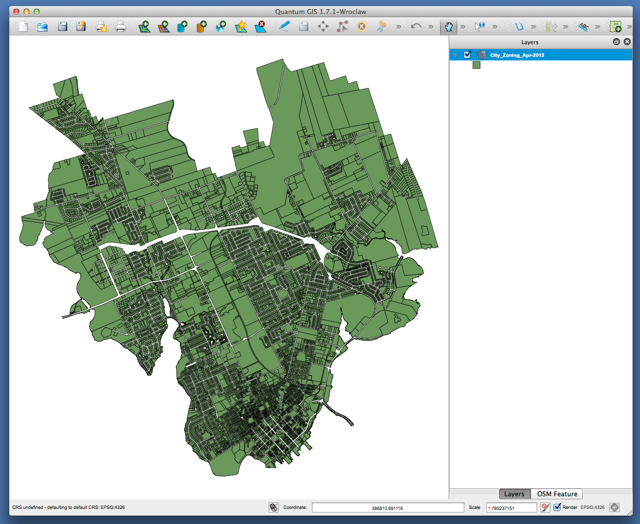

City of Charlottetown Zoning Map
================================

Here you will find ESRI Shapefiles of the City of Charlottetown, Prince Edward Island zoning designations for properties *as of April 2012*. 

These files originated with the City of Charlottetown, but are not an official release of the City. They are provided here for educational use only; commercial use or licensing may require a data license from the City of Charlottetown.

**Note that zoning is currently in flux and City Council is considering several large zoning changes, so by the time you encounter these files they may be out of date.**

You can most easily view these files with [Quantum GIS](http://www.qgis.org/) (aka QGIS), a multi-platform (Windows, MacOS X, Linux and Android) open source GIS application.

To open the zoning map in QGIS, just select **Layer | Add Vector Layer** from the QGIS menu and locate and select the **City_Zoning_Apr-2012.shp** file.

