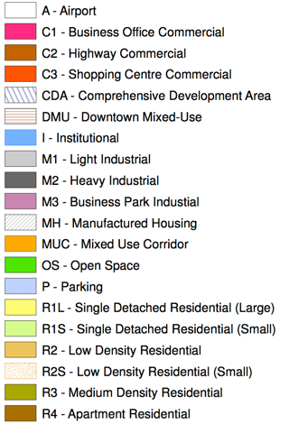

Charlottetown Zoning Bylaw Zones
================================

The zoning.csv file is a comma-delimted ASCII file of the zoning designations in the July 21, 2011 version of the [City of Charlottetown Zoning and Development By-law](http://www.city.charlottetown.pe.ca/pdfs/bylaws/ZoningDevelopment_Bylaw.pdf).

For each zone the columns are:

 * abbreviation (i.e. **C1**)
 * full designation (i.e. **Business Office Commercial**)
 * KML-format colour code (i.e. **80802bff**; see [this colour reference](https://developers.google.com/kml/documentation/kmlreference#color))
 
The colours were taken from the [Zoning Map](http://www.city.charlottetown.pe.ca/pdfs/ZoningMap.pdf); where hash patterns were used in the map, a close colour-equivalent was used here:

